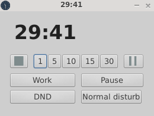
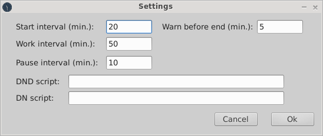
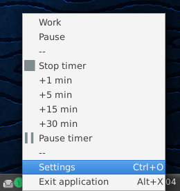

# BioRythm

Simple timer for pomodoro (or similar) technique.

Simple run, set some time and close to tray, or minimize to taskbar. Before
timeout (default 5 minutes), windows is yellow and restores for 2s every minute, after
timeout is restored for 5s every minute.

Buttons for stop reset timer, pause/play pause timer and numbered buttons
adding minutes to current timeout. If time is negative adding to 0m.

The buttons "Work" and "Pause" you can configure to your preferred time, and
can specify scripts which run on start work and pause interval.

## Overview

Main window:

Options:

Tray icon and menu:

## Install

[Download](https://www.dropbox.com/sh/3u1xyi47vd2oo9r/AAB5A0msqQv8_UpE1hEUDyuza/BioRythm?dl=0&lst=) and copy program BioRythm to your favourite path and executable. Settings is stored in ".BioRythm.xml" in actual path (I recommend run from home directory).

Of course you can checkout and compile (and feel free to modify)...
